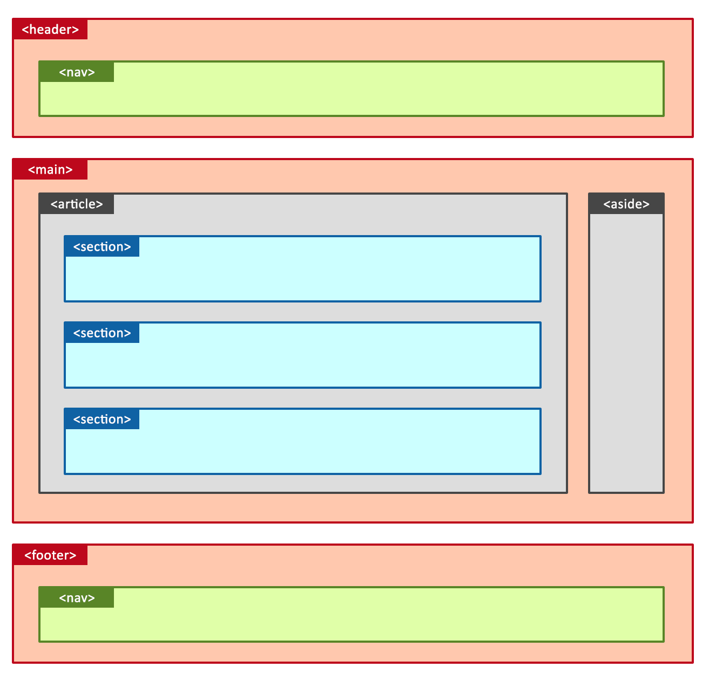

<p align="center">✨Dvurechensky✨</p>

## 👥 Синтаксис HTML и Селекторы CSS 👥

<p align="center"><h1 align="center"> ☀️ Базовая Структура HTML ☀️ </h1></p>

```html
<!DOCTYPE html>
<html lang="en">
<head>
    <meta charset="UTF-8">
    <meta name="viewport" content="width=device-width, initial-scale=1.0">
    <title>Document</title>
</head>
<body>
    <h1>Заголовок</h1>
    <p>Текст параграфа.</p>
</body>
</html>
```

- `<!DOCTYPE html>`: Объявление типа документа (HTML5).
- `<html></html>`: Корневой элемент HTML-документа.
- `<head></head>`: Содержит метаданные о документе (заголовок, кодировка, стили, скрипты).
- `<meta charset="UTF-8">`: Указывает кодировку символов (UTF-8 для поддержки большинства языков).
- `<meta name="viewport" content="width=device-width, initial-scale=1.0">`: Настройка области просмотра для адаптивного дизайна.
- `<title></title>`: Заголовок страницы, отображаемый во вкладке браузера.
- `<body></body>`: Содержит видимое содержимое страницы (текст, изображения, видео).

### 👥 Основные HTML Теги 👥

<p align="center"><h1 align="center"> ⭐ Структурные теги ⭐ </h1></p>




*   `<header></header>`: Шапка сайта или раздела.

    ```html
    <header>
        <h1>Название сайта</h1>
        <nav>...</nav>
    </header>
    ```
*   `<nav></nav>`: Навигационная панель.

    ```html
    <nav>
        <ul>
            <li><a href="#">Главная</a></li>
            <li><a href="#">О нас</a></li>
            <li><a href="#">Контакты</a></li>
        </ul>
    </nav>
    ```
*   `<main></main>`: Основное содержимое страницы.

    ```html
    <main>
        <article>...</article>
        <aside>...</aside>
    </main>
    ```

*   `<article></article>`: Самостоятельная часть контента (статья, пост в блоге).

    ```html
    <article>
        <h2>Заголовок статьи</h2>
        <p>Текст статьи...</p>
    </article>
    ```

*   `<aside></aside>`: Дополнительная информация (боковая панель).

    ```html
    <aside>
        <h3>Реклама</h3>
        <p>Рекламный текст...</p>
    </aside>
    ```

*   `<footer></footer>`: Подвал сайта или раздела.

    ```html
    <footer>
        <p>© 2023 Все права защищены</p>
    </footer>
    ```

*   `<section></section>`: Раздел содержимого.

    ```html
    <section>
        <h2>Заголовок раздела</h2>
        <p>Текст раздела...</p>
    </section>
    ```

*   `<div></div>`: Универсальный контейнер (не имеет семантического значения).

    ```html
    <div>
        <p>Содержимое внутри div.</p>
    </div>
    ```

<p align="center"><h1 align="center"> ⭐ Текст ⭐ </h1></p>

*   `<h1></h1>` - `<h6></h6>`: Заголовки разных уровней.

    ```html
    <h1>Заголовок первого уровня</h1>
    <h2>Заголовок второго уровня</h2>
    <h3>Заголовок третьего уровня</h3>
    ```
<h1>Заголовок первого уровня</h1>
<h2>Заголовок второго уровня</h2>
<h3>Заголовок третьего уровня</h3>

<br>
<hr style="border: 1px solid aqua;">
<br>

*   `<p></p>`: Параграф (абзац).

    ```html
    <p>Это текст параграфа.</p>
    ```
<p>Это текст параграфа.</p>

<br>
<hr style="border: 1px solid aqua;">
<br>

*   `<br>`: Перенос строки (без закрывающего тега).

    ```html
    Это строка текста.<br>
    Это новая строка.
    ```
Это строка текста.<br>
Это новая строка.

<br>
<hr style="border: 1px solid aqua;">
<br>

*   `<hr>`: Горизонтальная линия (без закрывающего тега).

    ```html
    <p>Текст над линией.</p>
    <hr>
    <p>Текст под линией.</p>
    ```
<p>Текст над линией.</p>
<hr>
<p>Текст под линией.</p>

<br>
<hr style="border: 1px solid aqua;">
<br>

*   `<a></a>`: Ссылка (анкор).

    ```html
    <a href="https://sites.google.com/view/dvurechensky">Ссылка на example.com</a>
    ```
<a href="https://sites.google.com/view/dvurechensky">Ссылка на example.com</a>

<br>
<hr style="border: 1px solid aqua;">
<br>


*   `<span></span>`: Строчный контейнер (не имеет семантического значения).

    ```html
    <p>Это <span>часть</span> текста.</p>
    ```
<p>Это <span>часть</span> текста.</p>

<br>
<hr style="border: 1px solid aqua;">
<br>

*   `<strong></strong>`: Важный текст (обычно отображается жирным шрифтом).

    ```html
    <p>Это <strong>важный</strong> текст.</p>
    ```
<p>Это <strong>важный</strong> текст.</p>

<br>
<hr style="border: 1px solid aqua;">
<br>

*   `<em></em>`: Выделенный текст (обычно отображается курсивом).

    ```html
    <p>Это <em>выделенный</em> текст.</p>
    ```
<p>Это <em>выделенный</em> текст.</p>

<br>
<hr style="border: 1px solid aqua;">
<br>

*   `<code></code>`: Код.

    ```html
    <code>
    let x = 5;
    </code>
    ```
<code>
let x = 5;
</code>

<br>
<hr style="border: 1px solid aqua;">
<br>

*   `<pre></pre>`:  Форматированный текст (сохраняет пробелы и переносы строк).

    ```html
    <pre>
    Это   текст,
    сохраненный с форматированием.
    </pre>
    ```
<pre>
Это   текст,
сохраненный с форматированием.
</pre>


<p align="center"><h1 align="center"> ⭐ Списки ⭐ </h1></p>

*   `<ul></ul>`: Неупорядоченный список.

    ```html
    <ul>
        <li>Элемент списка 1</li>
        <li>Элемент списка 2</li>
        <li>Элемент списка 3</li>
    </ul>
    ```

<ul>
    <li>Элемент списка 1</li>
    <li>Элемент списка 2</li>
    <li>Элемент списка 3</li>
</ul> 

<br>
<hr style="border: 1px solid aqua;">
<br>

*   `<ol></ol>`: Упорядоченный список.

    ```html
    <ol>
        <li>Элемент списка 1</li>
        <li>Элемент списка 2</li>
        <li>Элемент списка 3</li>
    </ol>
    ```
    - `<li></li>`: Элемент списка.

<ol>
    <li>Элемент списка 1</li>
    <li>Элемент списка 2</li>
    <li>Элемент списка 3</li>
</ol>

<p align="center"><h1 align="center"> ⭐ Изображения и мультимедиа ⭐ </h1></p>

*   ``: Изображение (без закрывающего тега).

    ```html
    
    ```


<br>
<hr style="border: 1px solid aqua;">
<br>

*   `<video></video>`: Видео.

    ```html
    <video width="320" height="240" controls>
        <source src="Media/Pump.mp4" type="video/mp4">
        Ваш браузер не поддерживает тег video.
    </video>
    ```

<video width="320" height="240" controls>
    <source src="Media/Pump.mp4" type="video/mp4">
    Ваш браузер не поддерживает тег video.
</video>

<br>
<hr style="border: 1px solid aqua;">
<br>

*   `<audio></audio>`: Аудио.

    ```html
    <audio controls>
        <source src="Media/ambience_bar_ground_larger.wav" type="audio/mpeg">
        Ваш браузер не поддерживает тег audio.
    </audio>
    ```
<audio controls>
    <source src="Media/ambience_bar_ground_larger.wav" type="audio/mpeg">
    Ваш браузер не поддерживает тег audio.
</audio>

<p align="center"><h1 align="center"> ⭐ Формы ⭐ </h1></p>

*   `<form></form>`: Форма.

    ```html
    <form action="/submit" method="post">
        <label for="name">Имя:</label>
        <input type="text" id="name" name="name"><br><br>
        <input type="submit" value="Отправить">
    </form>
    ```

    - `<label></label>`: Метка для элемента формы.
    - `<input>`: Элемент ввода (текст, пароль, флажок, радиокнопка, файл и т. д.).

        - `type="text"`: Текстовое поле.
        - `type="password"`: Поле для ввода пароля.
        - `type="email"`: Поле для ввода email.
        - `type="checkbox"`: Флажок.
        - `type="radio"`: Радиокнопка.
        - `type="file"`: Выбор файла.
        - `type="submit"`: Кнопка отправки формы.
        - `type="reset"`: Кнопка сброса формы.

<form action="/submit" method="post">
    <label for="name">Имя:</label>
    <input type="text" id="name" name="name"><br><br>
    <input type="submit" value="Отправить">
</form>

<br>
<hr style="border: 1px solid aqua;">
<br>

*   `<textarea></textarea>`: Многострочное текстовое поле.

    ```html
    <textarea rows="4" cols="50">Введите текст...</textarea>
    ```

<textarea rows="4" cols="50">Введите текст...</textarea>

<br>
<hr style="border: 1px solid aqua;">
<br>

*   `<select></select>`: Выпадающий список.

    ```html
    <select name="cars" id="cars">
        <option value="volvo">Volvo</option>
        <option value="saab">Saab</option>
        <option value="mercedes">Mercedes</option>
        <option value="audi">Audi</option>
    </select>
    ```

    - `<option></option>`: Элемент выпадающего списка.

<select name="cars" id="cars">
    <option value="volvo">Volvo</option>
    <option value="saab">Saab</option>
    <option value="mercedes">Mercedes</option>
    <option value="audi">Audi</option>
</select>

<br>
<hr style="border: 1px solid aqua;">
<br> 

*   `<button></button>`: Кнопка.

    ```html
    <button type="button">Нажми меня</button>
    ```

<button type="button">Нажми меня</button>
    
<p align="center"><h1 align="center"> ⭐ Таблицы ⭐ </h1></p>

*   `<table></table>`: Таблица.
*   `<tr></tr>`: Строка таблицы.
*   `<th></th>`: Заголовочная ячейка таблицы.
*   `<td></td>`: Ячейка данных таблицы.

    ```html
    <table>
        <tr>
            <th>Имя</th>
            <th>Возраст</th>
        </tr>
        <tr>
            <td>Иван</td>
            <td>30</td>
        </tr>
        <tr>
            <td>Мария</td>
            <td>25</td>
        </tr>
    </table>
    ```

<table>
    <tr>
        <th>Имя</th>
        <th>Возраст</th>
    </tr>
    <tr>
        <td>Иван</td>
        <td>30</td>
    </tr>
    <tr>
        <td>Мария</td>
        <td>25</td>
    </tr>
</table>

<p align="center"><h1 align="center"> ⭐ Встраиваемые элементы ⭐ </h1></p>

*   `<iframe></iframe>`: Встраиваемый фрейм (для вставки контента с другого сайта).

    ```html
    <iframe src="https://rutube.ru/channel/44085490/" width="600" height="400"></iframe>
    ```

<iframe src="https://rutube.ru/channel/44085490/" width="600" height="400"></iframe>

<p align="center"><h1 align="center"> ⭐ Селекторы CSS ⭐ </h1></p>

**`CSS`** (Cascading Style Sheets) используется для стилизации HTML-элементов. Селекторы **`CSS`** определяют, к каким элементам применяются стили.

*   **Селектор по тегу (Type Selector):**

    ```css
    p {
        color: blue;
    }
    ```

    Применяет стиль ко всем элементам `<p>`.

*   **Селектор по классу (Class Selector):**

    ```css
    .highlight {
        background-color: yellow;
    }
    ```

    Применяет стиль ко всем элементам с классом `highlight`.

    ```html
    <p class="highlight">Этот текст будет выделен.</p>
    ```

*   **Селектор по ID (ID Selector):**

    ```css
    #main-title {
        font-size: 24px;
    }
    ```

    Применяет стиль к элементу с ID `main-title`. (ID должен быть уникальным на странице).

    ```html
    <h1 id="main-title">Главный заголовок</h1>
    ```

*   **Универсальный селектор (Universal Selector):**

    ```css
    * {
        margin: 0;
        padding: 0;
    }
    ```

    Применяет стиль ко всем элементам на странице.  Используется для сброса стилей по умолчанию.

*   **Селектор атрибутов (Attribute Selector):**

    ```css
    a[href] {
        color: green;
    }

    input[type="text"] {
        border: 1px solid #ccc;
    }
    ```

    *   `a[href]`:  Выбирает все элементы `<a>` с атрибутом `href`.
    *   `input[type="text"]`: Выбирает все элементы `<input>` с атрибутом `type`, равным "text".

*   **Селектор потомков (Descendant Selector):**

    ```css
    ul li {
        list-style-type: square;
    }
    ```

    Выбирает все элементы `<li>`, которые являются потомками элемента `<ul>`.

*   **Селектор дочерних элементов (Child Selector):**

    ```css
    ul > li {
        border: 1px solid black;
    }
    ```

    Выбирает все элементы `<li>`, которые являются *непосредственными* дочерними элементами `<ul>`.

*   **Селектор смежных элементов (Adjacent Sibling Selector):**

    ```css
    h2 + p {
        font-style: italic;
    }
    ```

    Выбирает первый элемент `<p>`, который непосредственно следует за элементом `<h2>`.

*   **Селектор общих элементов (General Sibling Selector):**

    ```css
    h2 ~ p {
        color: red;
    }
    ```

    Выбирает все элементы `<p>`, которые являются общими братьями и сестрами элемента `<h2>` (то есть находятся на одном уровне и следуют после `<h2>`).

*   **Псевдоклассы (Pseudo-classes):**

    *   `:hover`:  Стиль применяется при наведении курсора мыши на элемент.

        ```css
        a:hover {
            color: red;
        }
        ```

    *   `:active`:  Стиль применяется, когда элемент активирован (например, нажата кнопка).

        ```css
        button:active {
            background-color: #ccc;
        }
        ```

    *   `:focus`: Стиль применяется, когда элемент в фокусе (например, текстовое поле).

        ```css
        input:focus {
            border: 2px solid blue;
        }
        ```

    *   `:visited`: Стиль для посещенных ссылок.

        ```css
        a:visited {
           color: purple;
        }
        ```

    * `:nth-child(n)`: Выбирает элемент, который является n-м потомком своего родителя

        ```css
        li:nth-child(odd) {
            background-color: #f2f2f2;
        }

        li:nth-child(even) {
            background-color: #ffffff;
        }
        ```

*   **Псевдоэлементы (Pseudo-elements):**

    *   `::before`:  Вставляет контент *перед* элементом.

        ```css
        p::before {
            content: "Читать далее: ";
        }
        ```

    *   `::after`: Вставляет контент *после* элемента.

        ```css
        h1::after {
            content: " - Новый заголовок";
        }
        ```
    *   `::first-line`:  Стилизует первую строку элемента.

        ```css
        p::first-line {
            font-weight: bold;
        }
        ```

    * `::first-letter`: Стилизует первую букву элемента

        ```css
        p::first-letter {
            font-size: 200%;
            color: red;
        }
        ```

#### Комбинирование селекторов

Селекторы можно комбинировать для создания более сложных правил:

```css
/* Элемент <p> с классом "highlight" внутри элемента <div> с ID "content" */
#content div p.highlight {
  font-size: 16px;
}
```

<p align="center">✨Dvurechensky✨</p>